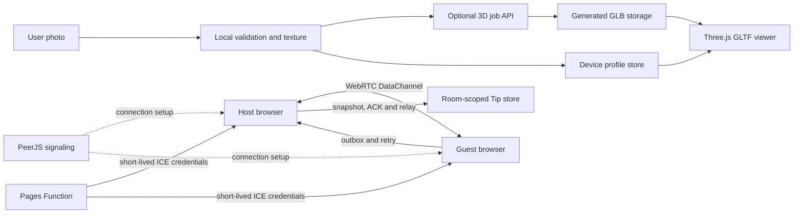

# Architecture

NewWorld Study Room is a Vite client with an optional Cloudflare Pages Function boundary. PeerJS establishes WebRTC DataChannels, while the Pages Function issues short-lived TURN credentials without exposing the long-lived key to browsers.

## Runtime flow

## State boundaries

- The profile store contains nickname, timer, music, doll style, photo texture, and optional model URL.
- Each host ID has a separate room store containing only room name and Tip history.
- Joining another room cannot merge its Tips into a future room.
- Outgoing guest Tips remain `pending` until the host returns a protocol ACK. Pending Tips survive reload and retry after reconnection.
- Legacy v1/v2 state migrates only when creating a local host room, never when following a guest invitation.

## P2P protocol

The host uses a small star topology with at most seven guests. Invitations contain a random token in the URL fragment; guests present it in PeerJS connection metadata. The host rejects invalid metadata, incompatible protocol versions, excess members, malformed messages, and peers sending more than six Tips per ten seconds.

Each Tip has bounded `id`, `by`, `text`, and `createdAt` fields. The host acknowledges valid guest Tips, deduplicates IDs, and relays them to other guests. Text is rendered through `textContent`.

## Cloudflare boundary

`functions/api/turn-credentials.js` reads `TURN_KEY_ID` and `TURN_KEY_API_TOKEN` from server-side bindings and requests one-day credentials from Cloudflare Realtime TURN. The browser receives only short-lived `iceServers`. If the endpoint is unavailable, P2P falls back to Cloudflare STUN.

Cloudflare Pages automatically uses `/` as the Vite base. GitHub Pages keeps `/newworld-study-room/`. `public/_headers` supplies CSP, permissions policy, clickjacking protection, and immutable asset caching on Cloudflare Pages.

## 3D provider contract

Local mode validates image type, file size, and decoded pixel count, center-crops to 768 px, and performs asynchronous JPEG compression. Provider mode posts the original file to `VITE_DOLL_GENERATION_URL` and accepts either a direct `modelUrl` or a pollable `statusUrl`.

The status response exposes `status`, `progress`, `message`, and `modelUrl`. Job and model URLs must be same-origin, typically through a Worker/R2 route. The Three.js viewer dynamically loads completed GLB files, frames them to the cabin, and falls back to the procedural doll on failure. Provider API and object-storage credentials stay behind the server boundary.

## Performance and quality

- Three.js, PeerJS, and GLTFLoader are split into lazy chunks.
- WebGL rendering stops outside the viewport and while the page is hidden.
- A process ID prevents an older image task from overwriting a newer upload.
- ESLint, Vitest, Vite build, Playwright, and axe run locally; GitHub CI runs unit/build checks and desktop browser tests.
- `prefers-reduced-motion` disables decorative motion while preserving state changes.
