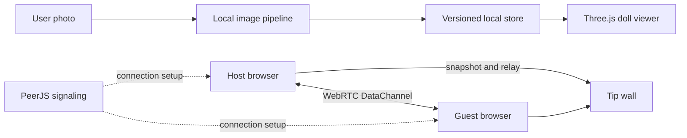

# Architecture

NewWorld Study Room is a static Vite application. It does not need an application server for the current MVP. PeerJS uses a signaling service to establish WebRTC DataChannels; Tip payloads then travel between browsers.

## Runtime flow

## Modules

- `src/main.js`: application composition and DOM event wiring.
- `src/state/store.js`: validated state, v1 migration, persistence, and Tip deduplication.
- `src/services/image-pipeline.js`: image validation, center crop, compression, and provider boundary.
- `src/services/doll-viewer.js`: Three.js scene, photo texture, animation, resize, and pointer controls.
- `src/services/p2p-room.js`: PeerJS lifecycle, host/guest roles, snapshots, presence, Tip relay, and reconnect handling.
- `src/services/focus-timer.js`: drift-resistant focus timer.

## P2P topology

The room host keeps one DataChannel per guest. Guests send Tips to the host, and the host relays each validated message to the other guests. Message IDs prevent duplicates. This topology is intentionally limited to small study rooms; it keeps room discovery and synchronization simple while preserving browser-to-browser payload transport.

The public PeerJS Cloud service is suitable for MVP signaling. Production should configure a private PeerServer and TURN credentials through the `VITE_PEER_*` and `VITE_TURN_*` environment variables.

## 3D provider boundary

The current image pipeline creates an optimized square texture for the procedural Three.js doll. A future AI provider can replace `prepareCompanionPhoto()` with a job API that returns a GLB URL while the store continues to expose the same processing states. Generated assets should be uploaded directly to object storage with signed URLs; API keys must remain server-side.

## Trust boundaries

- Incoming P2P messages are type checked, length limited, and rendered with `textContent`.
- Uploaded images are type and size checked, decoded locally, and compressed before persistence.
- Room links contain only a random PeerJS host ID; no image or Tip history is embedded in the URL.
- Local storage is best-effort. If quota is exceeded, the app drops the photo rather than breaking the room.
